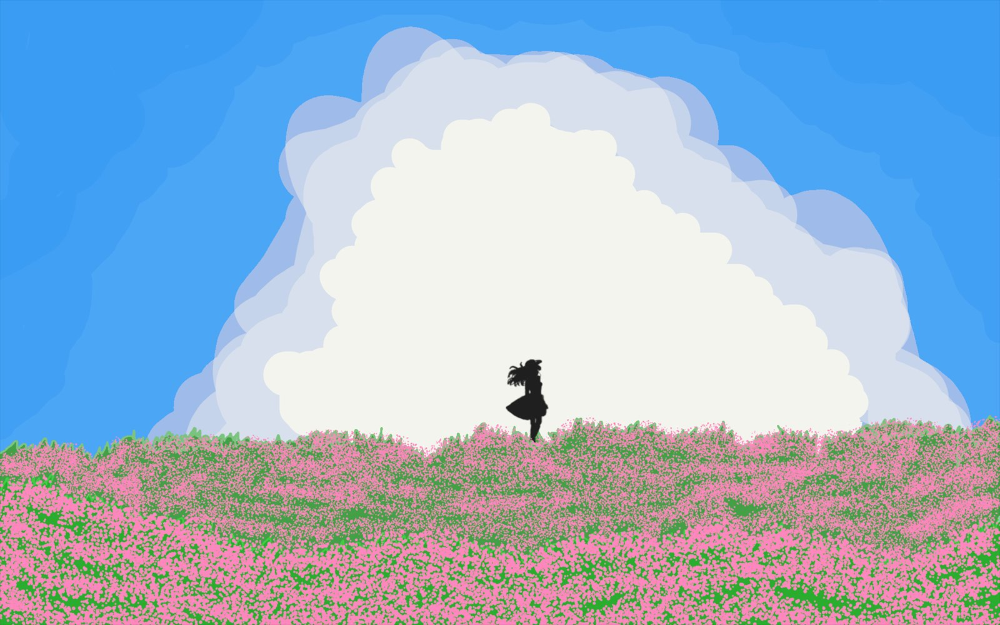
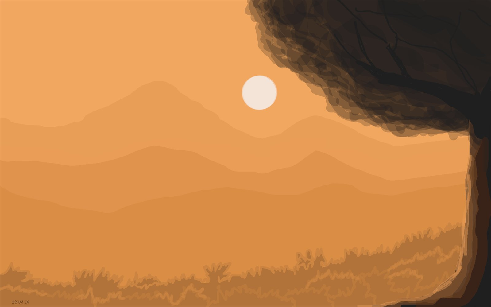
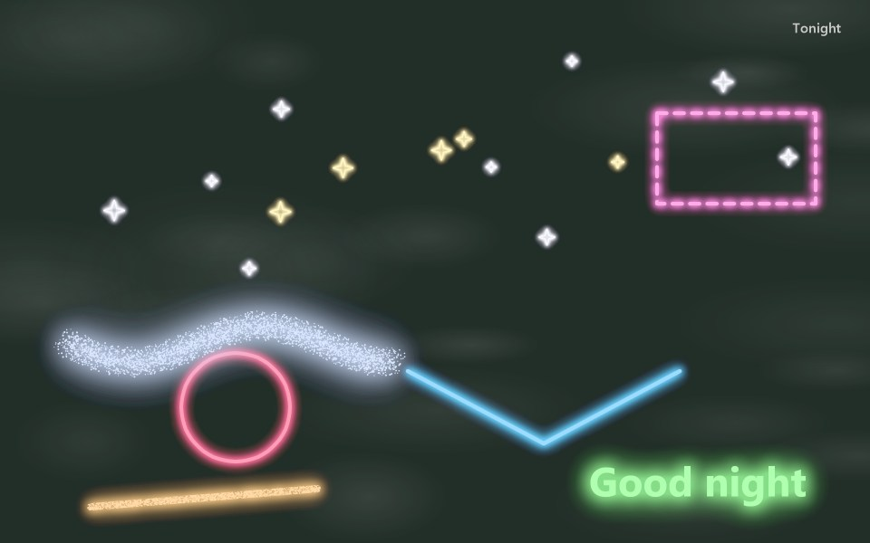
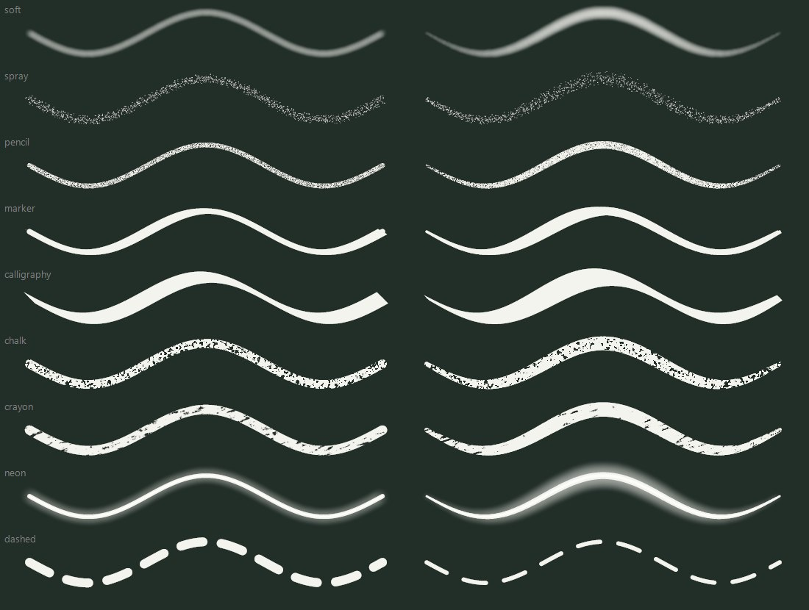
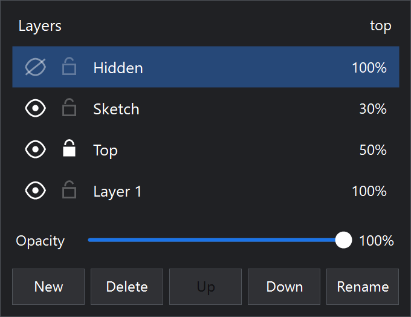
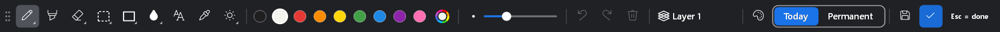
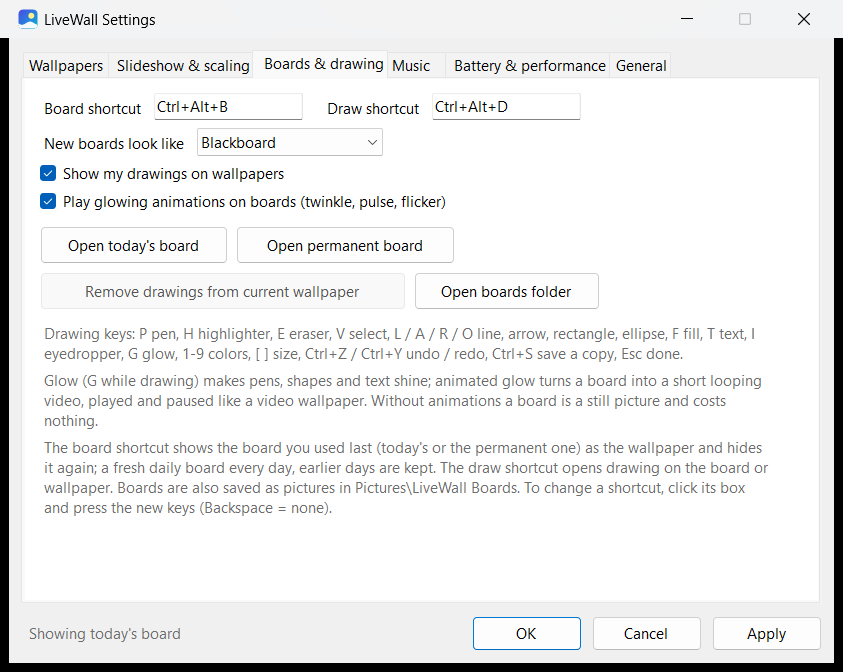

<div align="center">



<h1>LiveWall</h1>

<p><b>Live wallpapers for Windows that cost almost nothing to run.</b><br>
Videos, GIFs and pictures as your wallpaper, boards you paint on, glowing animated drawings,<br>
and music that knows when to be quiet.</p>

[](#requirements)
[](#building-from-source)
[](https://github.com/Purn0/LiveWall/releases/latest)
[](LICENSE)

<a href="https://github.com/Purn0/LiveWall/releases/latest"><b>Download</b></a> ·
<a href="#features">Features</a> ·
<a href="#getting-started">Getting started</a> ·
<a href="#keyboard-shortcuts">Shortcuts</a> ·
<a href="#building-from-source">Build from source</a>

<sub>The wallpaper above was painted with LiveWall's own brushes.</sub>

</div>

---

## Features

### Live wallpapers
- **Videos, GIFs and pictures** as the wallpaper: MP4, MOV, MKV, WMV, GIF, JPEG, PNG, WebP and more, as single files or whole folders, on every monitor.
- **Slideshow** with shuffle and a smooth fade between wallpapers, and **collections** (for example *Day* and *Night*) that can take over by the hour.
- **Drawings on any wallpaper**, video included: they sit above it and below the desktop icons.

### Boards
- A **daily board** that starts fresh every day (earlier days are kept) and a **permanent board**, shown as the wallpaper with one shortcut.
- Whiteboard, blackboard, grid or dotted paper; every board is also saved as a picture in *Pictures\LiveWall Boards*, and an animated one as a looping video too.

### Drawing
- **Pen, highlighter, eraser** (parts or whole strokes), **select** (rectangle or lasso: move, resize, rotate, flip, cut, copy, paste), **shapes**, **fill**, **text with emoji, kaomoji and symbols**, eyedropper and any color.
- **Nine brushes:** soft airbrush, spray, pencil, marker, calligraphy, chalk, crayon, neon and dashed, with adjustable spread. Shapes can be drawn with any brush.
- **Layers** on boards: up to eight, each with visibility, lock and opacity.
- **Glow:** strokes, shapes and text can shine, steadily or animated (*pulse*, *twinkle*, *flicker*). In spray and grainy brushes every speck twinkles on its own, and a board with animated glow plays as a seamless looping wallpaper.
- Pen pressure, touch, and pasting pictures from other apps or picture files copied in File Explorer.

### Music
- Music for all wallpapers or **per wallpaper**: a folder, chosen songs, the video's own soundtrack, or music matched to the **mood of the picture**.
- Fades out when another app plays sound, when a fullscreen or maximized app is in front, when the PC is locked or the screen is off, and comes back where it left off.

### Built to save power
| While… | LiveWall does |
|---|---|
| a **picture** or a still **board** is the wallpaper | nothing: Windows shows it, 0% CPU |
| a **video** plays | GPU decoding in a separate process, no audio stream (about 0.5% CPU for 1080p on an i7-1260P) |
| the desktop is **covered**, a game is fullscreen, the PC is locked or the screen is off | pauses, then closes the player process entirely |
| on **battery** or Energy Saver (optional) | pauses |
| music is **silent** | closes its player too, so the sound card and the PC can sleep |

Animated GIFs are converted once to hardware-decoded video, which is far cheaper than drawing GIF frames.

---

## Gallery

<table>
  <tr>
    <td width="50%"><p align="center"><sub>Painted on a board</sub></p></td>
    <td width="50%"><p align="center"><sub>Glow: twinkling stars, neon and glowing text</sub></p></td>
  </tr>
  <tr>
    <td width="50%"><p align="center"><sub>The brushes, with a mouse and with pen pressure</sub></p></td>
    <td width="50%"><p align="center"><sub>Layers on boards</sub></p></td>
  </tr>
</table>

<p align="center"><br><sub>The drawing toolbar</sub></p>

<p align="center"></p>

---

## Getting started

### Install
1. Download **LiveWall-1.0.zip** from [Releases](https://github.com/Purn0/LiveWall/releases/latest) and unzip it.
2. Double-click **Install LiveWall.cmd**. No administrator rights are needed.
3. Settings opens: add your videos, GIFs, pictures or folders (or drag them onto the list).

LiveWall starts with Windows from then on. Click its tray icon for Settings, or start it again from the Start menu, which never runs a second copy.

> Installing from a clone of this repository works the same way: **Install LiveWall.cmd** first builds LiveWall from the source with the C# compiler that ships with Windows.

### Uninstall
Double-click **Uninstall LiveWall.cmd**. It also puts your previous wallpaper back.

### Requirements
- Windows 10 or Windows 11 (the Windows 11 24H2 desktop is supported).
- .NET Framework 4.x, which is part of Windows.
- H.264 video always plays. HEVC, VP9 and AV1 need the matching *Video Extension* from the Microsoft Store.

---

## Keyboard shortcuts

| Shortcut | Action |
|---|---|
| <kbd>Ctrl</kbd>+<kbd>Alt</kbd>+<kbd>B</kbd> | Show or hide the board |
| <kbd>Ctrl</kbd>+<kbd>Alt</kbd>+<kbd>D</kbd> | Draw on the board or the wallpaper (again, or <kbd>Esc</kbd>, when done) |
| <kbd>Ctrl</kbd>+<kbd>Alt</kbd>+<kbd>W</kbd> | Next wallpaper collection |
| <kbd>Ctrl</kbd>+<kbd>Alt</kbd>+<kbd>M</kbd> | Pause or play the music |

All four can be changed in Settings. The Start menu also gets **LiveWall Board**, **LiveWall Draw** and **LiveWall Music**: pin them to the taskbar for one-click buttons.

<details>
<summary><b>While drawing</b></summary>

| Key | Tool or action |
|---|---|
| <kbd>P</kbd> | Pen (click the pen button again for brushes and spread) |
| <kbd>H</kbd> | Highlighter |
| <kbd>E</kbd> | Eraser (again: parts or whole strokes) |
| <kbd>V</kbd> | Select (again: rectangle or lasso) |
| <kbd>L</kbd> <kbd>A</kbd> <kbd>R</kbd> <kbd>O</kbd> | Line, arrow, rectangle, ellipse (<kbd>Shift</kbd>: straight, square, circle) |
| <kbd>F</kbd> | Fill (on a line or shape: recolor it) |
| <kbd>T</kbd> | Text, emoji, kaomoji and symbols |
| <kbd>I</kbd> | Eyedropper |
| <kbd>G</kbd> | Glow on or off (the glow button again: brightness, dimming, animation, speed) |
| <kbd>1</kbd>–<kbd>9</kbd> | Colors |
| <kbd>[</kbd> <kbd>]</kbd> | Smaller, larger |
| <kbd>Ctrl</kbd>+<kbd>Z</kbd> / <kbd>Ctrl</kbd>+<kbd>Y</kbd> | Undo, redo |
| <kbd>Ctrl</kbd>+<kbd>C</kbd> <kbd>Ctrl</kbd>+<kbd>X</kbd> <kbd>Ctrl</kbd>+<kbd>V</kbd> | Copy, cut, paste (pictures from other apps and files too) |
| <kbd>Delete</kbd> | Clear the layer (undoable) |
| <kbd>B</kbd> | Board background |
| <kbd>Tab</kbd> | Switch between today's and the permanent board |
| <kbd>Ctrl</kbd>+<kbd>S</kbd> | Save a copy as a picture |
| <kbd>Esc</kbd> | Done |

</details>

<details>
<summary><b>Command line</b></summary>

`LiveWall.exe` with one of these options talks to the running copy:

| Option | Action |
|---|---|
| `--settings=<tab>` | Open Settings on a tab: `wallpapers`, `slideshow`, `boards`, `music`, `battery`, `general` |
| `--next`, `--prev` | Next or previous wallpaper |
| `--pause`, `--resume`, `--toggle-pause` | Pause or resume |
| `--board`, `--draw` | Show or hide the board; start or finish drawing |
| `--next-collection`, `--collection=<name>` | Switch collections |
| `--music-toggle`, `--music-next`, `--music-volume=<0-100>` | Music |
| `--status` | Write the current state to the log |
| `--exit` | Quit |

</details>

---

## Where things are kept

| What | Where |
|---|---|
| Settings | `%APPDATA%\LiveWall\settings.ini` |
| Boards and drawings (plain text, one line per element) | `%APPDATA%\LiveWall\boards`, `%APPDATA%\LiveWall\ink` |
| Board pictures and animations | `Pictures\LiveWall Boards` |
| Log and cache | `%LOCALAPPDATA%\LiveWall` |

**Optional:** Settings can ask Claude for the mood of each wallpaper to pick matching music. This sends a small version of the picture once to Anthropic's API with *your own* key, which is stored encrypted for your Windows account. It is off by default; without it the mood comes from the picture's colors, on your PC.

---

## Building from source

No SDK or package manager is needed: LiveWall is plain C# 5 compiled by the C# compiler included with Windows (.NET Framework 4.x).

```powershell
powershell -ExecutionPolicy Bypass -File source\build.ps1
```

This writes `source\bin\LiveWall.exe`. `Install LiveWall.cmd` builds next to itself and installs in one step.

<details>
<summary><b>How it works</b></summary>

- **Video** plays in a child process (`--host`) through the Media Foundation Media Engine into a layered window placed behind the desktop icons; the process is closed whenever the wallpaper isn't visible.
- **Music** plays in its own child process (`--music`) and ends after a few seconds of silence, so no audio stream stays open.
- **Pictures and still boards** are handed to Windows as a normal wallpaper.
- **Drawings** are an append-only text log (every element has a unique id and never changes), rendered with GDI+; text and emoji go through DirectWrite.
- **Animated boards** are rendered once into an H.264 loop in the background and then played like any video.

</details>

---

## License

[MIT](LICENSE) © 2026 Muhtasim Al Ahsan
